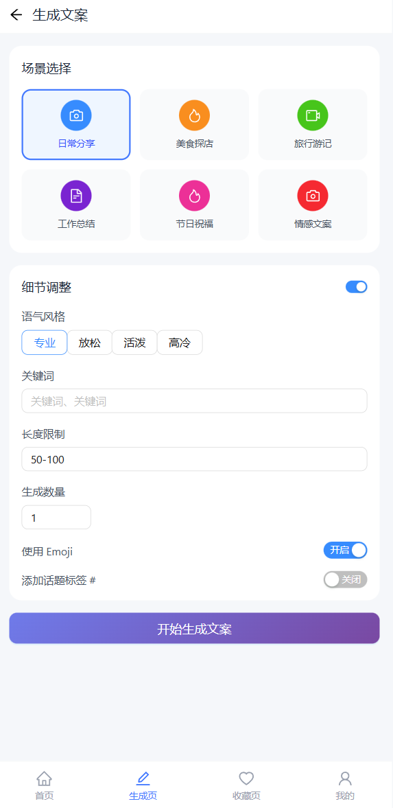
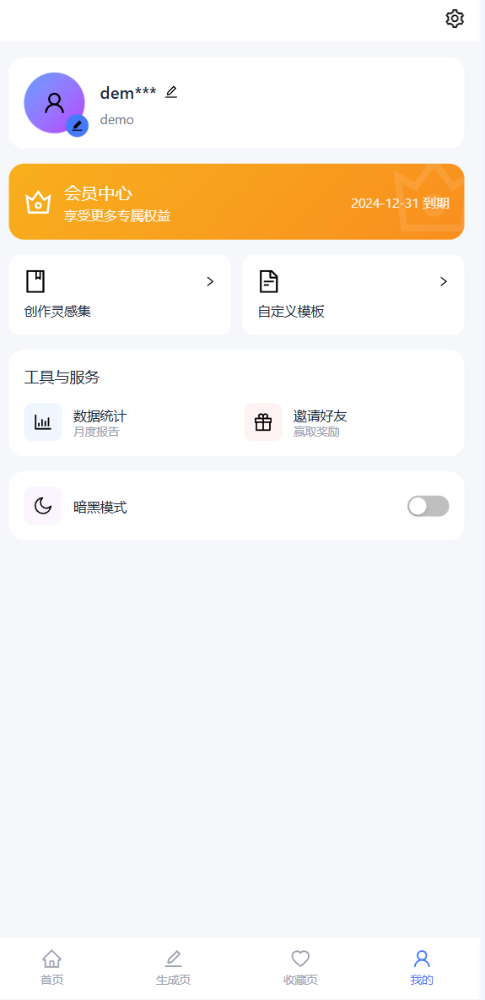
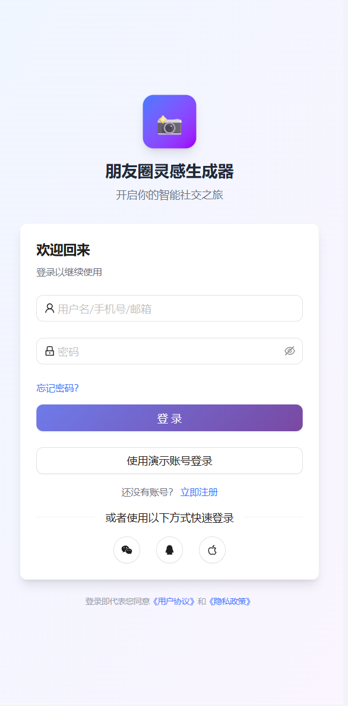

# AI 朋友圈文案生成器

<p align="center">
  
</p>

<p align="center">
  <strong>智能生成朋友圈文案，让你的社交更有格调</strong>
</p>

<p align="center">
  <a href="#功能特性">功能特性</a> •
  <a href="#技术栈">技术栈</a> •
  <a href="#快速开始">快速开始</a> •
  <a href="#项目截图">项目截图</a> •
  <a href="#目录结构">目录结构</a>
</p>

---

## 📱 项目介绍

AI 朋友圈文案生成器是一款基于阿里云通义千问大模型的智能文案生成工具。用户可以通过选择场景、风格、控制 Emoji 和话题标签等参数，快速生成适合发朋友圈的优质文案。支持文案收藏、历史记录管理等功能，帮助用户轻松打造个性化社交内容。

### 核心特性

- 🤖 **AI 智能生成** - 基于通义千问大模型，一键生成高质量文案
- 🎨 **多场景覆盖** - 支持日常分享、美食探店、旅行游记、工作总结等场景
- 📝 **个性化控制** - 可控制文案长度、Emoji 使用、话题标签等
- 💾 **本地数据管理** - 收藏和历史记录本地存储，数据安全
- 🔐 **用户权限管理** - 纯前端实现登录注册，支持路由权限控制
- 📱 **移动端适配** - 完美适配移动端 H5，体验流畅

---

## 🛠 技术栈

### 前端框架

| 技术 | 版本 | 说明 |
|------|------|------|
| React | 19.x | 核心框架 |
| TypeScript | 5.x | 类型系统 |
| Vite | 7.x | 构建工具 |

### UI 组件与样式

| 技术 | 版本 | 说明 |
|------|------|------|
| Ant Design | 6.x | UI 组件库 |
| Tailwind CSS | 4.x | 原子化 CSS |

### 状态管理与路由

| 技术 | 版本 | 说明 |
|------|------|------|
| Redux Toolkit | 2.x | 状态管理 |
| React Router | 7.x | 路由管理 |

### AI 与工具

| 技术 | 说明 |
|------|------|
| 阿里云通义千问 | AI 文案生成 |
| Axios | HTTP 请求 |
| localStorage | 本地数据持久化 |

---

## ✨ 功能模块

### 1. 首页 (Home)
- 🔍 顶部搜索栏 - 支持场景/风格搜索
- 🏷️ 高频场景入口 - 快速选择常用场景
- 🔥 热门文案推荐 - 展示热门文案横幅
- 📊 瀑布流列表 - 双列卡片式文案展示

### 2. 生成页 (Generate)
- 🎯 场景选择 - 宫格化场景选择（日常/美食/旅行/工作等）
- 🎨 风格调整 - 专业/放松/活泼/高冷等多种风格
- ⚙️ 参数控制 - 字数限制、生成数量、Emoji、话题标签
- 📝 结果展示 - 分卡片展示多条生成结果
- 📋 一键复制 - 支持单条文案复制（需登录）
- ⭐ 收藏功能 - 一键收藏喜欢的文案

### 3. 收藏页 (Collection)
- 💝 收藏管理 - 卡片式展示收藏的文案
- 📜 历史记录 - 查看历史生成记录
- 🔍 筛选功能 - 按场景/风格筛选
- 🗑️ 取消收藏 - 支持批量管理

### 4. 我的页 (Profile)
- 👤 个人信息 - 展示用户头像、昵称
- ⚙️ 设置中心 - 账户管理、退出登录
- 📊 数据统计 - 生成次数、收藏数量
- 🌙 主题切换 - 支持暗黑模式

### 5. 用户系统
- 🔐 登录/注册 - 纯前端实现，localStorage 存储
- 🛡️ 权限控制 - 路由守卫 + 操作级权限
- 🔄 登录跳转 - 登录后自动返回原页面

---

## 📸 项目截图

> 请将截图放入 `src/assets/images/` 目录，按以下命名规范：

### 首页
<p align="center">
  
</p>

### 生成页
<p align="center">
  
</p>

### 收藏页
<p align="center">
  
</p>

### 我的页
<p align="center">
  
</p>

### 登录页
<p align="center">
  
</p>

---

## 🚀 快速开始

### 环境要求

- Node.js >= 18.0.0
- npm >= 9.0.0

### 安装依赖

```bash
npm install
```

### 配置环境变量

1. 复制环境变量模板
```bash
cp src/env/.env.example src/env/.env
```

2. 编辑 `src/env/.env`，填入你的阿里云通义千问 API Key
```bash
VITE_DASHSCOPE_API_KEY=your_api_key_here
```

> 获取 API Key：[阿里云 DashScope](https://dashscope.aliyun.com/)

### 启动开发服务器

```bash
npm run dev
```

### 构建生产版本

```bash
npm run build
```

### 代码检查

```bash
npm run lint
```

---

## 📁 目录结构

```
ai-moments/
├── public/                    # 静态资源
│   └── vite.svg
├── src/
│   ├── api/                   # API 接口
│   │   └── aiMomentApi.ts     # 通义千问 API 封装
│   ├── assets/                # 资源文件
│   │   ├── images/            # 项目截图
│   │   └── mock/              # Mock 数据
│   ├── components/            # 公共组件
│   │   ├── AIMomentGenerator.tsx
│   │   └── RequireAuth.tsx    # 路由守卫
│   ├── config/                # 配置文件
│   │   ├── request.ts         # 请求配置
│   │   └── theme.ts           # 主题配置
│   ├── env/                   # 环境变量
│   │   └── .env               # API Key 配置
│   ├── hooks/                 # 自定义 Hooks
│   │   ├── useLocalStorage.ts
│   │   ├── useAppDispatch.ts
│   │   └── useAppSelector.ts
│   ├── layout/                # 布局组件
│   │   └── default/           # 默认布局（含底部导航）
│   ├── pages/                 # 页面组件
│   │   ├── Home/              # 首页
│   │   ├── Generate/          # 生成页
│   │   ├── Collection/        # 收藏页
│   │   ├── Profile/           # 我的页
│   │   ├── Login/             # 登录页
│   │   ├── Register/          # 注册页
│   │   └── Record/            # 历史记录页
│   ├── router/                # 路由配置
│   │   └── index.tsx
│   ├── store/                 # 状态管理
│   │   ├── modules/
│   │   │   └── copywritingSlice.ts
│   │   └── index.ts
│   ├── types/                 # 类型定义
│   │   ├── index.ts
│   │   └── home.ts
│   ├── utils/                 # 工具函数
│   │   ├── auth.ts            # 认证相关
│   │   ├── http.ts            # HTTP 封装
│   │   ├── request.ts         # 请求拦截器
│   │   └── error-handler.ts
│   ├── App.tsx
│   ├── main.tsx
│   └── index.css
├── index.html
├── package.json
├── tsconfig.json
├── vite.config.ts
├── tailwind.config.js
└── README.md
```

---

## 🔧 核心功能实现

### AI 文案生成

```typescript
// 调用通义千问 API 生成文案
const result = await generateMoment({
  prompt: '周末和朋友去吃火锅',
  scene: '美食',
  style: '活泼',
  count: 3,
  useEmoji: true,
  useHashtag: true,
  lengthLimit: '50-100'
});
```

### 路由权限控制

```typescript
// 需登录页面使用 RequireAuth 包裹
{
  path: 'collection',
  element: (
    <RequireAuth>
      <Collection />
    </RequireAuth>
  ),
}
```

### 本地数据存储

```typescript
// 使用封装的 useLocalStorage Hook
const [user, setUser] = useLocalStorage('user', null);

// 或使用 auth 工具函数
const { login, logout, getCurrentUser } = useAuth();
```

---

## 📝 更新日志

### v1.0.0 (2026-03-07)

- ✨ 初始版本发布
- 🤖 集成阿里云通义千问 AI 生成
- 📝 支持多场景、多风格文案生成
- 💾 实现本地收藏和历史记录
- 🔐 完成用户登录注册系统
- 📱 适配移动端 H5

---

## 🤝 贡献指南

欢迎提交 Issue 和 Pull Request！

1. Fork 本仓库
2. 创建你的特性分支 (`git checkout -b feature/AmazingFeature`)
3. 提交你的修改 (`git commit -m 'Add some AmazingFeature'`)
4. 推送到分支 (`git push origin feature/AmazingFeature`)
5. 打开一个 Pull Request

---

## 📄 许可证

[MIT](LICENSE) © 2026 AI Moments Team

---

<p align="center">
  Made with ❤️ by AI Moments Team
</p>
